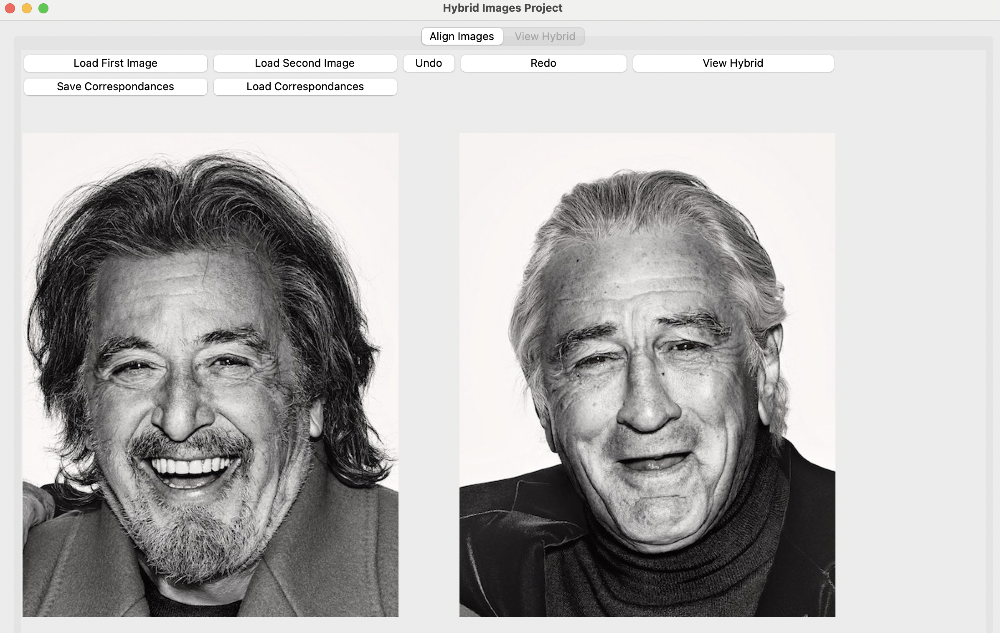
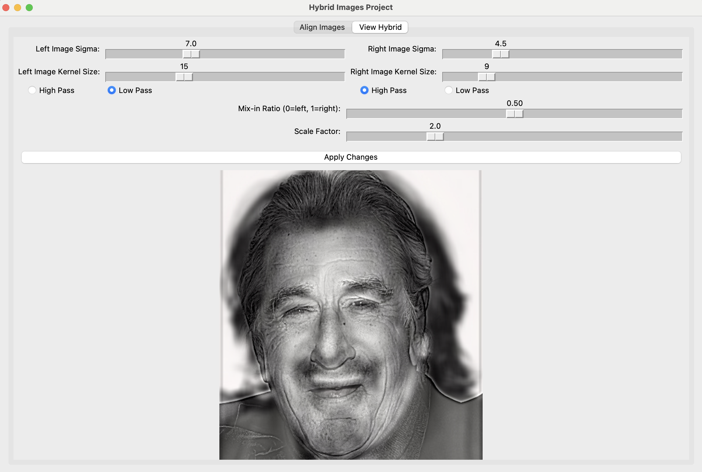

# 🎨 프로젝트 1: 하이브리드 이미지 생성

이 프로젝트는 두 이미지를 필터링하고 결합하여 보는 거리에 따라 다르게 인식되는 하이브리드 이미지를 만드는 과제입니다. 이미지 처리의 기본 원리인 Convolution과Gaussian Filter를 직접 구현해봅시다.


## ⚙️ 실습 환경 설정

과제 수행에 필요한 개발 환경을 설정합니다. `conda`를 사용하여 프로젝트별 가상 환경을 구성하는 것을 권장합니다. 아래 환경으로 실습을 진행하면서 에러가 발생하여 어려움을 겪을 경우 조교 메일로 문의하세요. 아래 환경으로 사용하지 않아서 발생되는 문제는 답해 드리지 않습니다.

1.  **Conda 가상 환경 생성**
    아래 명령어를 터미널에 입력하여 `ssu_project_1`이라는 이름의 파이썬 가상 환경을 만듭니다.
    ```bash
    conda create --name ssu_project_1 python=3
    ```

2.  **가상 환경 활성화**
    생성한 가상 환경에 진입합니다.
    ```bash
    conda activate ssu_project_1
    ```

3.  **필요한 라이브러리 설치**
    `requirements.txt` 파일에 명시된 라이브러리들을 한 번에 설치합니다.
    ```bash
    pip install -r requirements.txt
    ```


## 🎯 구현 목표

`hybrid.py` 파일 내에 정의된 4개의 핵심 함수를 주석을 참고해서 직접 구현하세요. AI agent을 이용하여 과제를 푸시는 것보다, 직접 구현해보시는 것을 추천드립니다.

-   `cross_correlation_2d`
-   `gaussian_blur_kernel_2d`
-   `low_pass`
-   `high_pass`

## 🚀 실행 및 테스트 방법

구현한 함수들이 올바르게 동작하는지 GUI 프로그램을 통해 테스트할 수 있습니다.

1.  **GUI 프로그램 실행**
    터미널에서 아래 명령어를 입력하여 GUI를 실행합니다.
    ```bash
    python gui.py
    ```

2.  **이미지 불러오기**
    -   `Load First Image` 버튼을 클릭하여 첫 번째 이미지를 불러옵니다. (assets 경로 아래에 이미지 있음)
    -   `Load Second Image` 버튼을 클릭하여 두 번째 이미지를 불러옵니다. (assets 경로 아래에 이미지 있음)
    -   이미지를 모두 불러오면 아래와 같은 화면이 나타납니다.
    -  
        

3.  **이미지 정렬 (Alignment)**
    두 이미지에서 대응하는 지점 **3개**를 각각 클릭하여 이미지의 위치를 정렬합니다. 예를 들어, 왼쪽 이미지에서 왼쪽 눈, 오른쪽 눈, 코를 순서대로 클릭했다면, 오른쪽 이미지에서도 왼쪽 눈, 오른쪽 눈, 코를 동일한 순서로 클릭해야 합니다.

    -   포인트 클릭 시 터미널에 아래와 같은 로그가 출력되는 것을 확인하세요.
        ```
        Clicked at: (134, 327), Total points: 1
        Clicked at: (243, 319), Total points: 2
        Clicked at: (198, 458), Total points: 3
        Clicked at: (165, 311), Total points: 1
        Clicked at: (274, 301), Total points: 2
        Clicked at: (235, 428), Total points: 3
        ```

4.  **하이브리드 이미지 확인**
    양쪽 이미지에 3개의 점을 모두 찍었다면 `View Hybrid` 버튼을 클릭하여 결과물을 확인합니다. 'View Hybrid' 탭에서 필터 강도(Sigma), 커널 크기(Kernel Size) 등을 조절하며 결과가 어떻게 변하는지 관찰해보세요.
    -  

## 퀴즈
아래 문제를 pdf 한 페이지로 정리해서 output에 집어 넣으세요. 
- 왜 세 개의 점을 각각 왼쪽 이미지와 오른쪽 이미지에서 찍어야할까요? gui.py의 getAffineTransform 함수와 관련지어 설명하세요. (참고 자료 : https://angeloyeo.github.io/2024/06/28/Affine_Transformation.html )

##  과제 제출
- 본 reop를 본인 컴퓨터에 pull하시고 hybrid.py 내 함수를 구현하세요.
- 그 다음 output 폴더 하나를 생성하시고 실습한 hybird image gui 화면를 한 장 첨부하세요.
- 퀴즈를 풀고 pdf 한 페이지를 output 폴더에 첨부하세요.
- push를 하면 자동으로 과제가 제출됩니다.

## 🚨 **주의사항**
과제의 목표는 이미지 처리의 핵심 원리를 직접 코드로 구현하며 이해하는 것입니다. 따라서 **아래 내장 함수 사용 시 0점 처리될 수 있으니** 각별히 유의해 주세요.

-   **사용 금지 함수:** `cv2.filter2D`, `scipy.signal.convolve2d` 등 컨볼루션 및 필터링을 한 번에 처리해주는 라이브러리 함수
-   **패널티:** 위에 명시된 함수나 유사한 기능을 하는 라이브러리 함수를 사용할 경우, 해당 부분은 **0점**으로 채점됩니다. 반드시 반복문(for loop)과 Numpy의 기본 연산을 활용하여 직접 알고리즘을 구현해 주세요.

